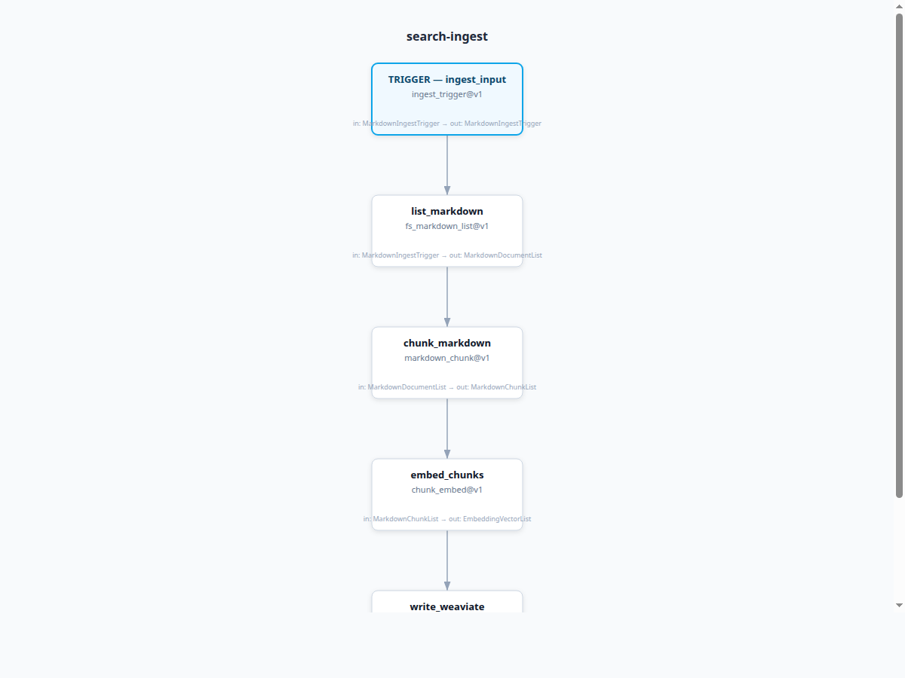

# BPG

Business Process Graph (BPG) is a declarative workflow system for defining, packaging, and running typed business process graphs.

## Motivating Example: Search Ingestion Pipeline



This image is a screenshot of the actual `bpg visualize` output (same renderer used by the dashboard graph view):

```bash
uv run bpg visualize examples/search/ingest.bpg.yaml --output-dir docs/assets
google-chrome --headless --disable-gpu \
  --screenshot=docs/assets/search-ingest-pipeline.png \
  --window-size=1200,900 \
  file:///home/ryan/play/bpg/docs/assets/ingest.bpg.html
```

YAML used to produce this pipeline (`examples/search/ingest.bpg.yaml`):

<!-- BEGIN:search-ingest-yaml -->
```yaml
metadata:
  name: search-ingest
  version: 0.1.0
  description: "Planned markdown ingestion flow for Weaviate."

imports:
  - ./search-resources.bpg.yaml

node_types:
  ingest_trigger@v1:
    in: MarkdownIngestTrigger
    out: MarkdownIngestTrigger
    provider: dashboard.form
    version: v1
    config_schema: {}

  fs_markdown_list@v1:
    in: MarkdownIngestTrigger
    out: MarkdownDocumentList
    provider: fs.markdown_list
    version: v1
    config_schema:
      root_dir: string?
      glob: string?

  markdown_chunk@v1:
    in: MarkdownDocumentList
    out: MarkdownChunkList
    provider: text.markdown_chunk
    version: v1
    config_schema:
      chunk_size: number
      overlap: number

  chunk_embed@v1:
    in: MarkdownChunkList
    out: EmbeddingVectorList
    provider: embed.text
    version: v1
    config_schema:
      model: string?

  weaviate_upsert@v1:
    in: EmbeddingVectorList
    out: IngestStats
    provider: weaviate.upsert
    version: v1
    config_schema:
      store: enum(search_main)
      collection: string

nodes:
  ingest_input:
    type: ingest_trigger@v1
    config: {}

  list_markdown:
    type: fs_markdown_list@v1
    config: {}

  chunk_markdown:
    type: markdown_chunk@v1
    config:
      chunk_size: 1200
      overlap: 200

  embed_chunks:
    type: chunk_embed@v1
    config:
      model: text-embedding-3-large

  write_weaviate:
    type: weaviate_upsert@v1
    config:
      store: search_main
      collection: docs_chunks

trigger: ingest_input

edges:
  - from: ingest_input
    to: list_markdown
    with:
      root_dir: trigger.in.root_dir
      glob: trigger.in.glob
  - from: list_markdown
    to: chunk_markdown
    with:
      documents: list_markdown.out.documents
  - from: chunk_markdown
    to: embed_chunks
    with:
      chunks: chunk_markdown.out.chunks
  - from: embed_chunks
    to: write_weaviate
    with:
      items: embed_chunks.out.items
```
<!-- END:search-ingest-yaml -->

## Install From GitHub

Install as an application (recommended):

```bash
uv tool install "git+https://github.com/ginstrom/bpg.git"
```

or:

```bash
pipx install "git+https://github.com/ginstrom/bpg.git"
```

Then run:

```bash
bpg --help
```

## Documentation

- [User Manual](manual/USER_MANUAL.md)
- [BPG Specification](docs/bpg-spec.md)
- [Search Examples](examples/search/README.md)

## Quick Plan/Show Workflow

```bash
uv run bpg plan process.bpg.yaml --out plan.out
uv run bpg show --json plan.out
uv run bpg show --json plan.out | jq '.changes'
```

## Search Example

Runnable ingestion/retrieval example graphs are in `examples/search/`.
See [examples/search/README.md](examples/search/README.md).

## Local Dev Setup

```bash
uv venv
source .venv/bin/activate
uv sync
uv run bpg --help
```
