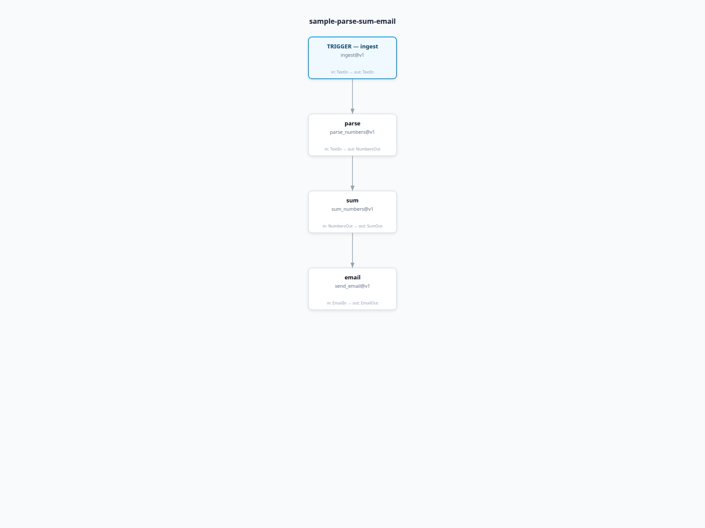

# BPG

Business Process Graph (BPG) lets AI agents build reliable business processes.

AI systems often fail when they generate orchestration code directly. BPG provides a constrained, typed process language so agents can design, validate, and evolve business workflows with deterministic behavior and auditability.

Instead of writing orchestration code, define process graphs:

- nodes -> tasks
- edges -> explicit data flow
- conditions -> routing decisions

BPG validates the architecture and executes it with consistent runtime semantics.

## 30-Second Example

```yaml
metadata:
  name: readme-quickstart
  version: 1.0.0
  description: "Parse numbers from text and compute their sum."

nodes:
  ingest:
    type: ingest@v1
    config: {}
  parse:
    type: parse_numbers@v1
    config: {}
  sum:
    type: sum_numbers@v1
    config: {}

trigger: ingest

edges:
  - from: ingest
    to: parse
    with:
      text: ingest.out.text
  - from: parse
    to: sum
    with:
      numbers: parse.out.numbers

output: sum.out
```

This shows the graph shape only. For a full runnable version (including `types` and `node_types`), use [`examples/wrappers/parse-sum-email/process.bpg.yaml`](examples/wrappers/parse-sum-email/process.bpg.yaml).

Run the full example:

```bash
uv run bpg doctor examples/wrappers/parse-sum-email/process.bpg.yaml
uv run bpg apply examples/wrappers/parse-sum-email/process.bpg.yaml --auto-approve
uv run bpg run sample-parse-sum-email --input examples/wrappers/parse-sum-email/input.yaml --engine local
uv run bpg visualize examples/wrappers/parse-sum-email/process.bpg.yaml --output-dir docs/assets
```



## Key Capabilities

- Declarative process architecture for agent-generated systems
- Strong compile-time validation with machine-readable diagnostics
- Deterministic execution semantics with pluggable backends
- Human-in-the-loop primitives for review/approval workflows
- Replayable run/event history for debugging and audits

## Install

```bash
uv tool install "git+https://github.com/ginstrom/bpg.git"
# or
pipx install "git+https://github.com/ginstrom/bpg.git"
```

```bash
bpg --help
```

## Quickstart Commands

```bash
uv run bpg init --name review-incoming-support-requests --with-review --output process.bpg.yaml --todos-out todos.json
uv run bpg doctor process.bpg.yaml --json
uv run bpg plan process.bpg.yaml --json --explain
uv run bpg apply process.bpg.yaml --auto-approve
uv run bpg run <process-name> --input input.json --engine local
uv run bpg replay <run-id> --json
```

## License

BPG is licensed under the Functional Source License (FSL).

You may use, modify, and distribute this software for any purpose except offering it as a hosted service.

On January 1, 2029 this project will automatically convert to the Apache License 2.0.

See [LICENSE](LICENSE), [LICENSE-APACHE](LICENSE-APACHE), and [NOTICE](NOTICE).

## Documentation Map

- [Overview](docs/overview.md)
- [Quickstart](docs/quickstart.md)
- Concepts:
  - [Process](docs/concepts/process.md)
  - [Nodes](docs/concepts/nodes.md)
  - [Edges](docs/concepts/edges.md)
  - [Execution](docs/concepts/execution.md)
  - [Human Steps](docs/concepts/human_steps.md)
  - [Versioning](docs/concepts/versioning.md)
- Guides:
  - [Build Process](docs/guides/build_process.md)
  - [Add AI Step](docs/guides/add_ai_step.md)
  - [Add Human Review](docs/guides/add_human_review.md)
  - [Modify Process](docs/guides/modify_process.md)
  - [Debug Validation Errors](docs/guides/debug_validation_errors.md)
  - [Testing Processes](docs/guides/testing_processes.md)
  - [System Integration Tests](docs/guides/system_integration_tests.md)
- Reference:
  - [Process Schema](docs/reference/process_schema.md)
  - [Node Schema](docs/reference/node_schema.md)
  - [Edge Schema](docs/reference/edge_schema.md)
  - [Type System](docs/reference/type_system.md)
  - [Provider Interface](docs/reference/provider_interface.md)
  - [Error Codes](docs/reference/error_codes.md)
- CLI:
  - [plan](docs/cli/plan.md)
  - [apply](docs/cli/apply.md)
  - [doctor](docs/cli/doctor.md)
  - [run](docs/cli/run.md)
- Patterns:
  - [Approval Workflow](docs/patterns/approval_workflow.md)
  - [Retry Pattern](docs/patterns/retry_pattern.md)
  - [Validation Pattern](docs/patterns/validation_pattern.md)
  - [Parallel Processing](docs/patterns/parallel_processing.md)
  - [AI Evaluation Pipeline](docs/patterns/ai_evaluation_pipeline.md)
- Examples:
  - [Document Pipeline](docs/examples/document_pipeline.md)
  - [Insurance Claims](docs/examples/insurance_claims.md)
  - [Support Automation](docs/examples/support_automation.md)
  - [Compliance Review](docs/examples/compliance_review.md)
- AI:
  - [How Agents Should Use BPG](docs/ai/how_agents_should_use_bpg.md)
  - [Prompt Patterns](docs/ai/prompt_patterns.md)
  - [Repair Strategies](docs/ai/repair_strategies.md)

## Runnable Examples

- Search ingestion/retrieval graphs: [examples/search/README.md](examples/search/README.md)
- Wrapper-focused examples: [examples/wrappers/README.md](examples/wrappers/README.md)
- Gemini structured extraction with run artifacts: [examples/ai/gemini-imdb/README.md](examples/ai/gemini-imdb/README.md)

## Local Development

```bash
uv venv
source .venv/bin/activate
uv sync
uv run bpg --help
make test-ai-metrics
```
