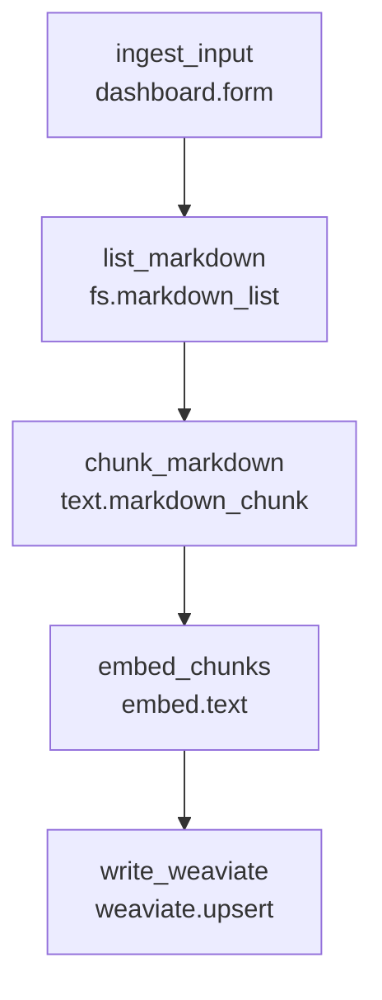
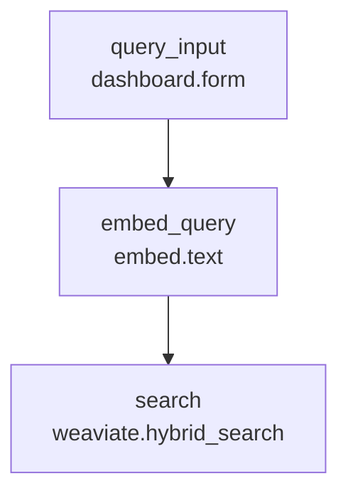

# Search Examples (Weaviate Pattern)

This folder demonstrates the recommended two-graph search pattern:

- `ingest.bpg.yaml`: markdown ingestion and indexing.
- `retrieve.bpg.yaml`: query embedding + hybrid retrieval.
- `search-resources.bpg.yaml`: shared store/type contract imported by both.

These examples run with built-in providers:

- `fs.markdown_list`
- `text.markdown_chunk`
- `embed.text`
- `weaviate.upsert`
- `weaviate.hybrid_search`

## Graphs

### Ingest (`ingest.bpg.yaml`)



### Retrieve (`retrieve.bpg.yaml`)



## Quick Run

From repo root:

```bash
source .venv/bin/activate
mkdir -p /tmp/bpg-search-docs /tmp/bpg-search-store
printf "# Guide\n\nBPG typed graphs are searchable.\n" > /tmp/bpg-search-docs/guide.md

BPG_SEARCH_STORE_DIR=/tmp/bpg-search-store uv run bpg apply examples/search/ingest.bpg.yaml
BPG_SEARCH_STORE_DIR=/tmp/bpg-search-store uv run bpg run search-ingest --input <(printf "root_dir: /tmp/bpg-search-docs\nglob: '*.md'\n")

BPG_SEARCH_STORE_DIR=/tmp/bpg-search-store uv run bpg apply examples/search/retrieve.bpg.yaml
BPG_SEARCH_STORE_DIR=/tmp/bpg-search-store uv run bpg run search-retrieve --input <(printf "query: typed graphs\n")
```

Both flows use the same datastore contract via `config.store: search_main`.
